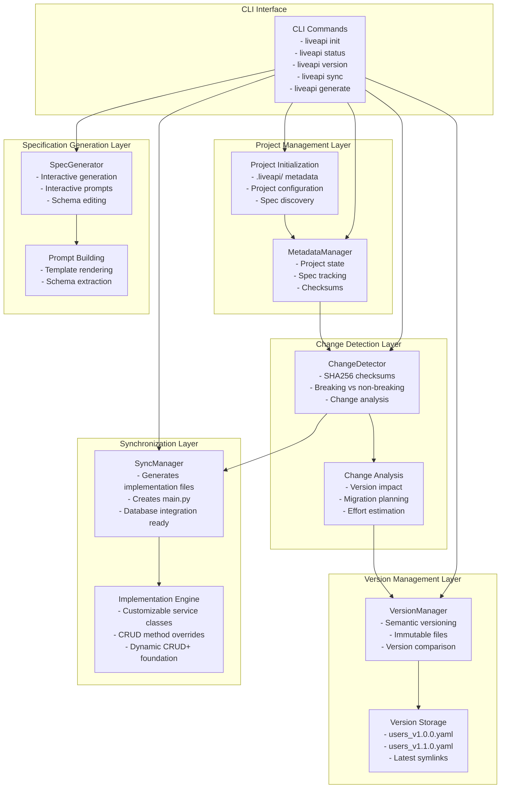
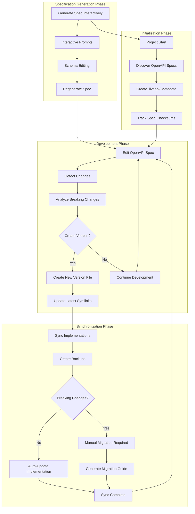
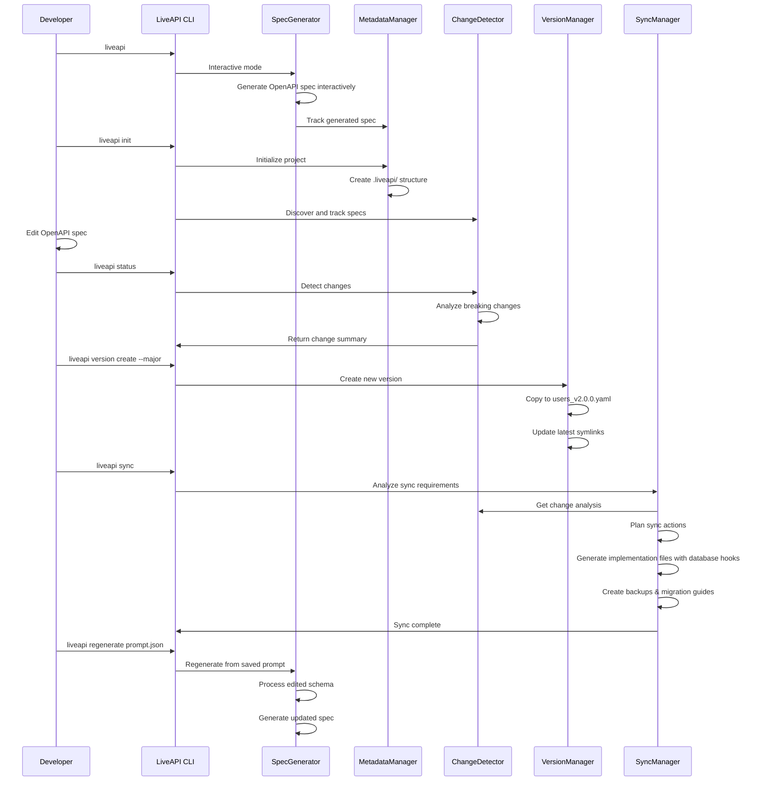

# LiveAPI Architecture

This document describes the internal architecture of LiveAPI - a comprehensive API lifecycle management system that handles OpenAPI specification evolution, version control, change detection, and implementation synchronization.

## Overview

**LiveAPI** provides complete API lifecycle management from specification design through production deployment. It handles version control, change detection, implementation synchronization, and migration planning while ensuring safe API evolution.

## Core Architecture



## Workflow Architecture



## Component Details

### MetadataManager (`metadata/` package)
- **Purpose**: Manage project state and specification tracking
- **Key Components**:
  - `manager.py`: Main MetadataManager class
  - `models.py`: ProjectConfig and SpecMetadata classes
  - `utils.py`: Helper functions for checksums and gitignore management
- **Key Features**:
  - Project configuration management in `.liveapi/config.json`
  - Specification metadata storage in `.liveapi/specs.json`
  - Checksum-based change detection
  - Sync status tracking and last sync timestamps
- **Storage**: `.liveapi/` directory with JSON configuration files

### ChangeDetector (`change_detector/` package)
- **Purpose**: Detect and analyze changes in OpenAPI specifications
- **Key Components**:
  - `detector.py`: Main ChangeDetector class
  - `analyzer.py`: Change analysis logic
  - `models.py`: Data models for change detection
  - `utils.py`: Helper functions
- **Key Features**:
  - SHA256 checksum comparison for fast change detection
  - Breaking vs non-breaking change classification
  - Detailed change analysis (paths, schemas, parameters, responses)
  - Version impact assessment and migration recommendations
- **Integration**: Provides change data to VersionManager and SyncManager

### VersionManager (`version/` package)
- **Purpose**: Handle immutable versioning and semantic version management
- **Key Components**:
  - `manager.py`: Main VersionManager class
  - `models.py`: Version and VersionedSpec classes
  - `comparator.py`: Version comparison logic
  - `migration.py`: Migration plan generation
- **Key Features**:
  - Semantic versioning (major.minor.patch) with auto-increment
  - Immutable version files (`users_v1.0.0.yaml`, `users_v1.1.0.yaml`)
  - Version comparison and migration effort estimation
  - Latest symlink management for current versions
- **Storage**: `specifications/` directory with versioned files and `latest/` symlinks

### SyncManager (`sync/` package)
- **Purpose**: Generate customizable implementation files and prepare project for production
- **Key Components**:
  - `manager.py`: Main SyncManager class
  - `plan.py`: SyncPlan and planning logic
  - `executor.py`: Implementation file generation (scaffold mode)
  - `crud_sync.py`: Dynamic CRUD+ mode (legacy)
- **Key Features**:
  - **Default Mode**: Generates customizable service classes in `implementations/` directory
  - **Database Integration**: CRUD method overrides with clear database integration points
  - **Business Logic Hooks**: Built-in spots for validation, logging, caching, events
  - **Error Handling**: RFC 7807 compliant error responses with proper exception handling
  - **Auto-discovery**: Creates main.py that auto-loads custom service implementations
  - **Fallback Mode**: `--crud` flag for legacy dynamic CRUD+ behavior
- **Integration**: Generates production-ready implementation files while maintaining LiveAPI infrastructure

### SpecGenerator (`generator/` package)
- **Purpose**: Generate OpenAPI specifications with streamlined interactive workflow
- **Key Components**:
  - `generator.py`: Main SpecGenerator class
  - `prompt.py`: Prompt building and template handling
  - `interactive.py`: Improved interactive generation workflow
  - `utils.py`: Helper functions
- **Key Features**:
  - **Streamlined UX**: Object-first workflow with smart auto-inference
  - **No duplicate questions**: Auto-infer API name/description from resource info
  - **JSON array examples**: Clean format for providing multiple examples
  - **Professional implementation**: Generates proper FastAPI specs with RFC 7807 errors
  - Interactive prompts for API design with smart defaults
  - Saved prompts for regeneration and schema editing workflow
- **Integration**: Generates specifications that can be versioned and synchronized

### CLI Interface (`cli/` package)
- **Purpose**: Provide command-line interface for LiveAPI
- **Key Components**:
  - `main.py`: Main entry point
  - `utils.py`: CLI utilities
  - `commands/`: Command implementations
- **Key Features**:
  - Interactive mode with guided workflows
  - Complete command set for all LiveAPI operations
  - Preview mode for destructive operations
  - Detailed help and documentation

## Data Flow



## Directory Structure

```
liveapi/
├── src/
│   └── liveapi/
│       ├── __init__.py
│       ├── metadata_manager.py    # Facade for metadata package
│       ├── metadata/              # Metadata management package
│       │   ├── __init__.py        # Re-exports
│       │   ├── manager.py         # Main MetadataManager class
│       │   ├── models.py          # Data models
│       │   └── utils.py           # Helper functions
│       ├── change_detector.py     # Facade for change_detector package
│       ├── change_detector/       # Change detection package
│       │   ├── __init__.py        # Re-exports
│       │   ├── models.py          # Data models
│       │   ├── detector.py        # Main detector class
│       │   ├── analyzer.py        # Analysis logic
│       │   └── utils.py           # Helper functions
│       ├── version_manager.py     # Facade for version package
│       ├── version/               # Version management package
│       │   ├── __init__.py        # Re-exports
│       │   ├── manager.py         # Main VersionManager class
│       │   ├── models.py          # Version models
│       │   ├── comparator.py      # Version comparison
│       │   └── migration.py       # Migration planning
│       ├── sync_manager.py        # Facade for sync package
│       ├── sync/                  # Synchronization package
│       │   ├── __init__.py        # Re-exports
│       │   ├── manager.py         # Main SyncManager class
│       │   ├── plan.py            # Sync planning
│       │   ├── executor.py        # Sync execution
│       │   ├── crud_sync.py       # main.py generation
│       │   └── models.py          # Sync models
│       ├── implementation/        # Dynamic implementation engine (IMPROVED!)
│       │   ├── __init__.py
│       │   ├── app.py
│       │   ├── crud_handlers.py
│       │   ├── exceptions.py
│       │   ├── liveapi_parser.py
│       │   ├── liveapi_router.py  # RFC 7807 errors, correct parameters
│       │   └── pydantic_generator.py
│       ├── spec_generator.py      # Facade for generator package
│       ├── generator/             # Specification generation package
│       │   ├── __init__.py        # Re-exports
│       │   ├── generator.py       # Main SpecGenerator class
│       │   ├── prompt.py          # Prompt building
│       │   ├── interactive.py     # Interactive workflow
│       │   └── utils.py           # Helper functions
│       ├── cli.py                 # Facade for CLI package
│       └── cli/                   # CLI package
│           ├── __init__.py        # Re-exports
│           ├── main.py            # Main entry point
│           ├── utils.py           # CLI utilities
│           └── commands/          # Command implementations
│               ├── __init__.py
│               ├── project.py
│               ├── version.py
│               ├── sync.py
│               ├── generate.py
│               └── server.py
├── .liveapi/                      # Project metadata
│   ├── config.json               # Project configuration
│   ├── specs.json                # Specification tracking
│   ├── prompts/                  # Saved prompts and schemas
│   └── backups/                  # Implementation backups
├── specifications/               # Versioned OpenAPI specs
├── implementations/             # Generated service classes (NEW!)
│   ├── users_service.py         # Database-ready CRUD implementations
│   └── products_service.py      # Customizable business logic
├── main.py                      # Auto-loads custom implementations
├── tests/
└── pyproject.toml
```

## Key Benefits

### Interactive Specification Generation
- **Streamlined Interactive Workflow**: Object-first approach with smart auto-inference.
- **No Duplicate Questions**: API name/description auto-suggested from resource info.
- **JSON Array Examples**: Clean format for providing multiple example objects.
- **Professional FastAPI Implementation**: Correct parameter names, typed schemas, RFC 7807 errors.
- **Saved Prompts**: Iterate on API designs with saved prompts.
- **Schema Editing**: Edit clean JSON instead of complex OpenAPI YAML.
- **Regeneration**: Easily regenerate specs from modified prompts or schemas.

### Safe API Evolution
- **Immutable Versioning**: Never overwrite existing specs
- **Change Detection**: Fast SHA256-based change identification
- **Breaking Change Analysis**: Automatically classify impact
- **Migration Planning**: Step-by-step upgrade guides

### Development Workflow
- **Specification-First**: Start with OpenAPI spec design
- **Implementation Generation**: Generate customizable service classes with database hooks
- **Database Integration**: Clear CRUD method overrides for production database connections
- **Business Logic Extension**: Built-in hooks for validation, logging, caching, events
- **Change Management**: Track changes and manage versions seamlessly
- **Preview Mode**: Safe operations with --preview flag

### Team Collaboration
- **Shared Metadata**: Team-synchronized via `.liveapi/`
- **Change Visibility**: Clear breaking vs non-breaking change detection
- **Migration Planning**: Effort estimation and step-by-step guides
- **Safe Updates**: Preview mode prevents accidents

## Performance Considerations

- **Change Detection**: O(1) checksum comparison for fast change identification
- **Version Storage**: Immutable files with symlink optimization
- **Sync Operations**: Batched operations with progress reporting
- **Metadata**: JSON-based storage for fast read/write operations
- **Scaling**: Efficient handling of multiple API specifications

## Command Reference

### Core Commands
- `liveapi` - Interactive mode (guides you through the process)
- `liveapi init` - Initialize project with metadata tracking
- `liveapi generate` - Generate OpenAPI spec interactively
- `liveapi regenerate <prompt>` - Regenerate from saved prompt
- `liveapi status` - Show changes and sync status
- `liveapi validate` - Validate OpenAPI specifications
- `liveapi version create` - Create new immutable version
- `liveapi version list` - List all versions
- `liveapi version compare` - Compare version differences
- `liveapi sync` - Generate customizable implementation files (default)
- `liveapi sync --crud` - Use dynamic CRUD+ mode (legacy)
- `liveapi run` - Start development server

### Workflow Example
```bash
# Start in interactive mode
liveapi

# Or initialize new project
liveapi init

# Generate a spec interactively
liveapi generate

# Check for changes
liveapi status

# Create major version for breaking changes
liveapi version create --major

# Preview sync changes
liveapi sync --preview

# Execute sync
liveapi sync

# Test the API
liveapi run

# Regenerate from saved prompt with modifications
liveapi regenerate .liveapi/prompts/my_api_prompt.json
```

This architecture provides complete API lifecycle management with safe evolution, version control, and automated implementation synchronization.
