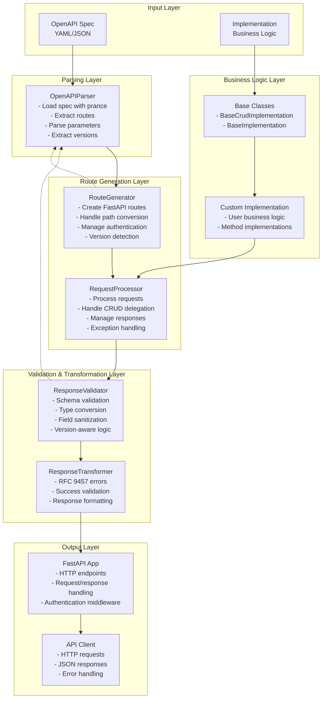
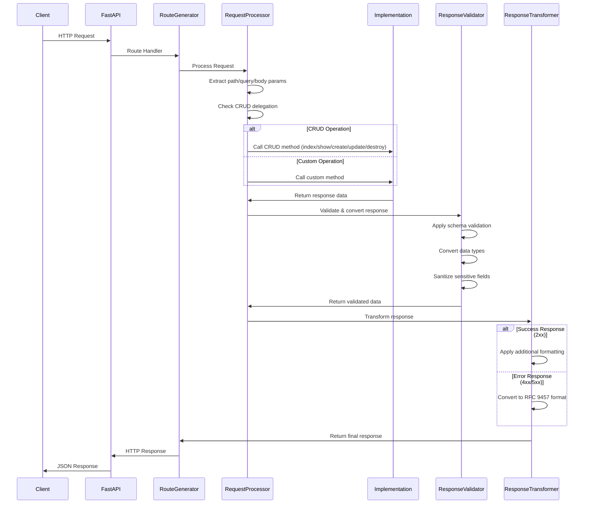
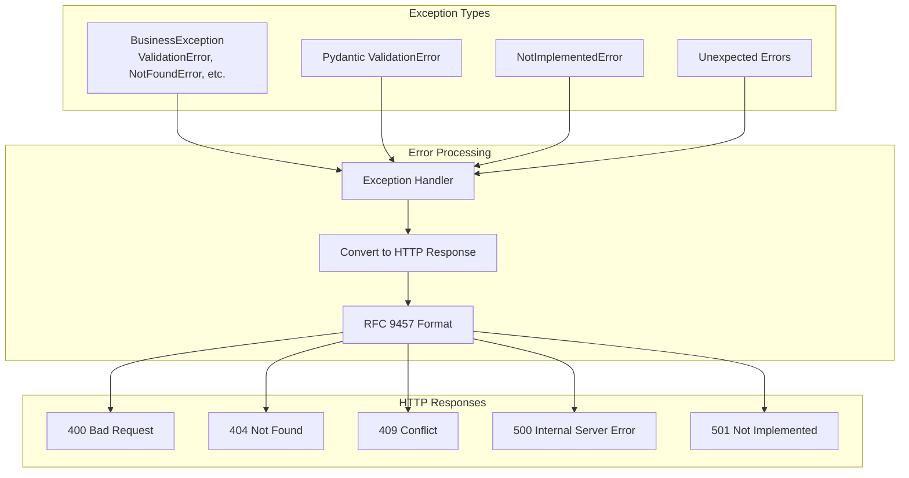

# Automatic Framework Architecture

This document describes the internal architecture of the Automatic framework, showing how OpenAPI specifications are dynamically converted to FastAPI routes at runtime.

## Overview

Automatic eliminates code generation by parsing OpenAPI specifications at runtime and dynamically creating FastAPI routes. The framework provides Rails-style base classes and comprehensive validation to ensure API contract compliance.

## Core Architecture



## Request Flow



## Component Details

### OpenAPIParser
- **Purpose**: Parse OpenAPI specifications using the `prance` library
- **Key Features**:
  - Loads YAML/JSON specifications
  - Extracts route information (paths, methods, parameters)
  - Parses response schemas for validation
  - Detects API versions from filenames and operation IDs
- **Integration**: Provides parsed data to RouteGenerator and ResponseValidator

### RouteGenerator
- **Purpose**: Convert OpenAPI routes to FastAPI routes
- **Key Features**:
  - Creates dynamic FastAPI route handlers
  - Manages path parameter conversion
  - Handles authentication dependencies
  - Coordinates request processing
- **Integration**: Creates FastAPI-compatible route handlers that delegate to RequestProcessor

### RequestProcessor
- **Purpose**: Process incoming requests and coordinate business logic
- **Key Features**:
  - Extracts and validates request parameters
  - Handles CRUD operation delegation to base classes
  - Manages version-aware method calls
  - Processes responses and exceptions
- **Integration**: Bridges FastAPI requests with business logic implementations

### ResponseValidator
- **Purpose**: Validate and convert response data to match OpenAPI schemas
- **Key Features**:
  - Schema-based validation against OpenAPI response definitions
  - Automatic type conversion (string→int, string→bool, etc.)
  - Field sanitization (removes sensitive data)
  - Version-aware processing logic
  - Graceful failure handling
- **Integration**: Processes successful responses before final transformation

### ResponseTransformer
- **Purpose**: Transform responses to standardized formats
- **Key Features**:
  - RFC 9457 compliant error responses
  - Integrates with ResponseValidator for success responses
  - Consistent error formatting
- **Integration**: Final response processing before returning to client

### Base Classes
- **BaseCrudImplementation**: Provides standard CRUD operations (index, show, create, update, destroy)
- **BaseImplementation**: Base class for custom business logic with helper methods

## Authentication Flow

```mermaid
graph LR
    subgraph "Auth Types"
        APIKEY[API Key Auth<br/>X-API-Key header]
        BEARER[Bearer Token Auth<br/>Authorization header]
    end
    
    subgraph "Auth Processing"
        EXTRACT[Extract Credentials]
        VALIDATE[Validate Against Config]
        INJECT[Inject auth_info]
    end
    
    subgraph "Business Logic"
        METHOD[Implementation Method]
        AUTHINFO[data['auth'] available]
    end
    
    APIKEY --> EXTRACT
    BEARER --> EXTRACT
    EXTRACT --> VALIDATE
    VALIDATE --> INJECT
    INJECT --> METHOD
    METHOD --> AUTHINFO
```

## Version Handling

```mermaid
graph TB
    subgraph "Version Detection"
        FILENAME[Filename Pattern<br/>users_v2.yaml]
        OPERID[Operation ID<br/>get_user_v3]
        DEFAULT[Default: v1]
    end
    
    subgraph "Version Processing"
        EXTRACT[Extract Version]
        ROUTE[Add to Route Info]
        METHOD[Pass to Method]
    end
    
    subgraph "Implementation"
        VMETHOD[Version-aware Method<br/>method(data, version=2)]
        LEGACY[Legacy Method<br/>method(data)]
    end
    
    FILENAME --> EXTRACT
    OPERID --> EXTRACT
    DEFAULT --> EXTRACT
    
    EXTRACT --> ROUTE
    ROUTE --> METHOD
    
    METHOD --> VMETHOD
    METHOD --> LEGACY
```

## Error Handling



## Data Flow Example

For a GET request to `/users/123`:

1. **Client** sends `GET /users/123`
2. **FastAPI** routes to generated handler
3. **RouteGenerator** calls RequestProcessor
4. **RequestProcessor** extracts `user_id: "123"` from path
5. **RequestProcessor** checks for CRUD delegation → calls `implementation.show("123", auth_info)`
6. **Implementation** returns `{"id": "123", "name": "John", "active": "true"}`
7. **ResponseValidator** validates against schema:
   - Converts `id: "123"` → `id: 123` (string to int)
   - Converts `active: "true"` → `active: true` (string to bool)
   - Sanitizes any sensitive fields
8. **ResponseTransformer** applies final formatting
9. **FastAPI** returns JSON response: `{"id": 123, "name": "John", "active": true}`

## Key Benefits

- **No Code Generation**: Everything happens at runtime
- **Schema Compliance**: Automatic validation ensures API contract adherence
- **Type Safety**: Automatic type conversion based on OpenAPI schemas
- **Security**: Built-in field sanitization and authentication
- **Flexibility**: Support for custom business logic and version-aware APIs
- **Standards Compliance**: RFC 9457 error responses and OpenAPI 3.0 support

## Performance Considerations

- **Parsing**: OpenAPI specs are parsed once at startup
- **Route Generation**: Routes are created once during application initialization
- **Request Processing**: Minimal overhead per request
- **Validation**: Schema validation adds ~1-2ms per response
- **Caching**: Response schemas are cached for fast validation

## Extensibility

The architecture supports extension through:
- **Custom Base Classes**: Inherit from BaseImplementation for specialized patterns
- **Authentication Providers**: Implement custom auth strategies
- **Validation Rules**: Extend ResponseValidator for custom validation logic
- **Response Transformers**: Add custom response formatting logic